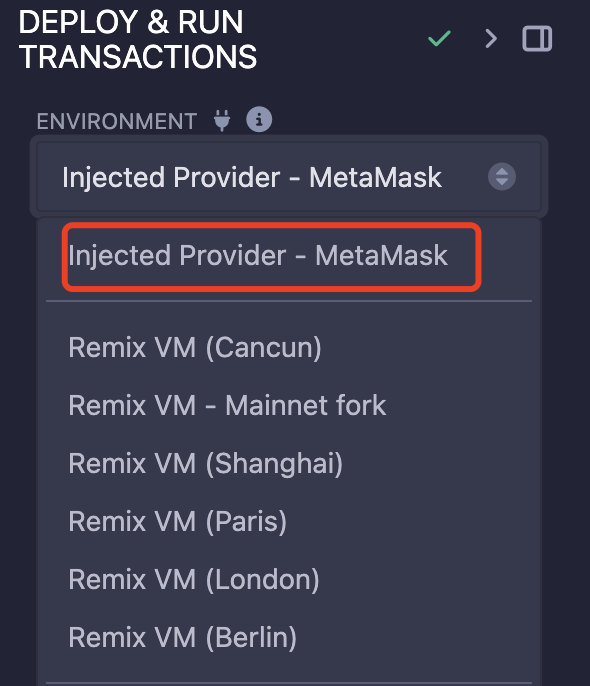
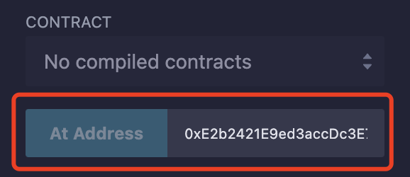

# 2-Fallback

# 问题描述

Look carefully at the contract's code below.

You will beat this level if

1. you claim ownership of the contract
2. you reduce its balance to 0

Things that might help

- How to send ether when interacting with an ABI
- How to send ether outside of the ABI
- Converting to and from wei/ether units (see `help()` command)
- Fallback methods

```solidity
// SPDX-License-Identifier: MIT
pragma solidity ^0.8.0;

contract Fallback {
    mapping(address => uint256) public contributions;
    address public owner;

    constructor() {
        owner = msg.sender;
        contributions[msg.sender] = 1000 * (1 ether);
    }

    modifier onlyOwner() {
        require(msg.sender == owner, "caller is not the owner");
        _;
    }

    function contribute() public payable {
        require(msg.value < 0.001 ether);
        contributions[msg.sender] += msg.value;
        if (contributions[msg.sender] > contributions[owner]) {
            owner = msg.sender;
        }
    }

    function getContribution() public view returns (uint256) {
        return contributions[msg.sender];
    }

    function withdraw() public onlyOwner {
        payable(owner).transfer(address(this).balance);
    }

    receive() external payable {
        require(msg.value > 0 && contributions[msg.sender] > 0);
        owner = msg.sender;
    }
}
```

# 代码分析

这个问题其实十分简单

- contribute只允许用户每次发送少于0.001个ether，但是contract的deployer有1000个，所以在contribute里面想要变成owner，需要通过contribute超过1000，几乎很难完成
- 另一个`owner=msg.sender`的代码在`receive`函数里面，这里只要满足两个条件即可，也就是发送的值大于0以及实在contribution的列表中
    - `msg.value > 0` 很简单，
    - `contributions[msg.sender] > 0`也很简单，只要做一次contribution就行
- 满足两个条件，做一次没有call data的low level transaction并且发送一点eth，因为发送了eth，所以fallback函数的`receive`函数会被调用，满足条件后，owner变成了发送者
    - 满足了目的一
- owner有可以调用`withdraw`函数来提取所有合约所有的balance，让其归零
    - 满足了目的二

# 攻击办法

1. 发送1个wei，然后使用`contribute`函数调用，这可以是我们成为`contributions`里面的一员
2. 然后在发送1个wei，这次使用low level cal，不带任何数据，fallback合约的`receive`函数会被调用
我们就成为了owner
3. 因为成为了owner，我们可以直接调用`withdraw`函数，使其balance归零，进入我们的口袋

# 小白的思考

问题很简单，但是怎么互动搞了很久。

Remix上面可以直接复制代码，compile源文件，然后

- 在Environment中选择Inject Provider - Metamask
    
    
    
- 然后在at address中输入目标instance即可（代码需要一致）
    
    
    
- 之后可以直接通过点击接口来调用api
- Low Level Call可以直接在最下面调取，不放入data就是发送eth，不调用任何函数
